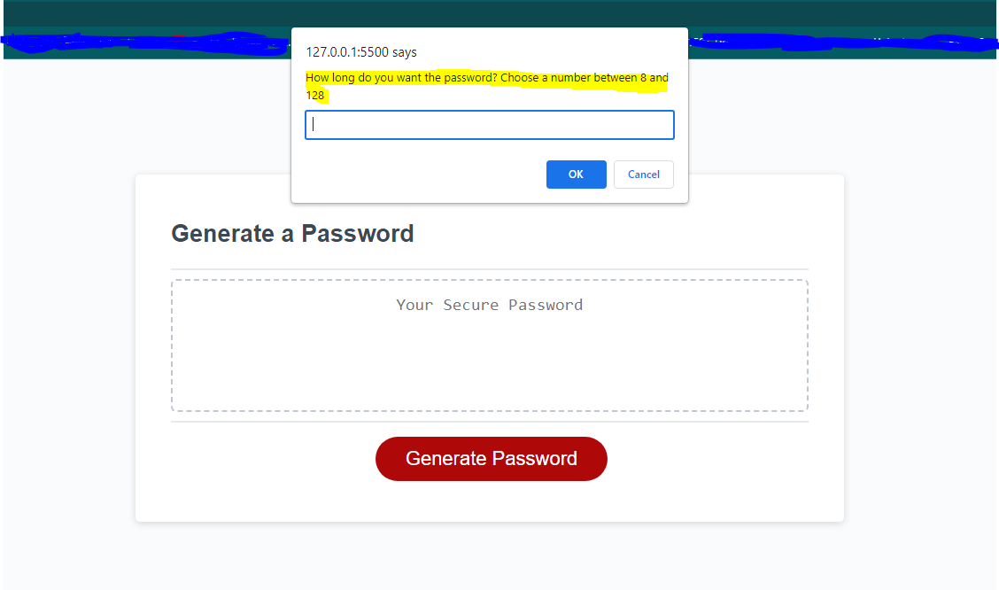
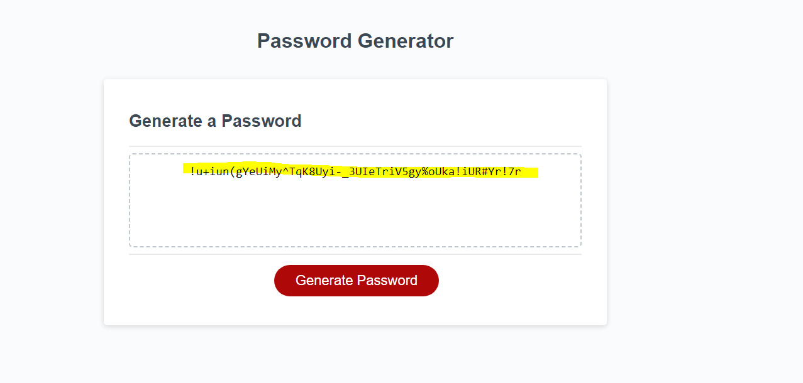

# Random-Password-Generator

## Description

This repository is for an application that generates a STRONG password of randomly generated characters based on users preferences. The application was created in order to provide greater security for those users that might have access to sensitive data. It solves the problem of the user having to manually type out random characters in order to generate a complex password. A complex password should have a minimum of eight characters and include various character types that might include uppercase letters, lowercase letters, numeric digits, or special characters. As a software developer, from creating this application, I was able to test my understanding of the basics of Java Script that includes primitive data types, conditional statements, arrays, iterations, scope, objects, and methods as it relates to Java Scripts object oriented programming.  

## Usage 

In order to use this application, first, you will need to go to the application url which can be found here >http//google.com// placeholder>>. Then you will need to click the "Generate Password" button or subsequently tab over to the button and press "Enter" on your keyboard. 

This will then prompt you to enter a password length between "8" and "128" characters and press okay. Next you will be prompted a few more times whether you want your password to contain lowercase letters, uppercase letters, numbers, and/or special characters. Below you can see a screenshot of the first prompt.

After answer all the prompts are answered then your password customized random password will be generated for you on the screen. 

Keep in mind that  if you do not select any character types (i.e. lowercase, uppercase, etc.) to be included in your generated password then you will be alerted that you must select at least one character type and then you will need to click on the "Generate Password" button again to restart the application. 

## License

MIT License

Copyright (c) [year] [fullname]

Permission is hereby granted, free of charge, to any person obtaining a copy of this software and associated documentation files (the "Software"), to deal in the Software without restriction, including without limitation the rights to use, copy, modify, merge, publish, distribute, sublicense, and/or sell copies of the Software, and to permit persons to whom the Software is furnished to do so, subject to the following conditions:

The above copyright notice and this permission notice shall be included in all copies or substantial portions of the Software.

THE SOFTWARE IS PROVIDED "AS IS", WITHOUT WARRANTY OF ANY KIND, EXPRESS OR IMPLIED, INCLUDING BUT NOT LIMITED TO THE WARRANTIES OF MERCHANTABILITY, FITNESS FOR A PARTICULAR PURPOSE AND NONINFRINGEMENT. IN NO EVENT SHALL THE AUTHORS OR COPYRIGHT HOLDERS BE LIABLE FOR ANY CLAIM, DAMAGES OR OTHER LIABILITY, WHETHER IN AN ACTION OF CONTRACT, TORT OR OTHERWISE, ARISING FROM, OUT OF OR IN CONNECTION WITH THE SOFTWARE OR THE USE OR OTHER DEALINGS IN THE SOFTWARE.
